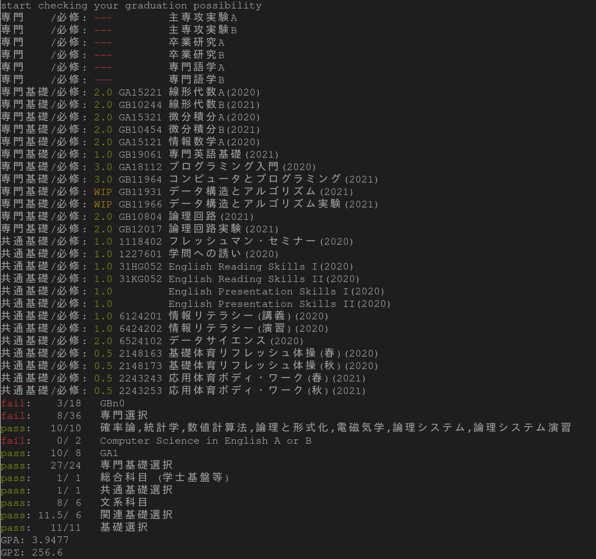

# tanici

筑波大学の履修管理システム [twins](https://twins.tsukuba.ac.jp/) が出力するCSV(UTF-8)をもとに，coins20（情報科学類2020年度生）が卒業可能であるかを判定し不足を出力します．おまけとしてGPAの算出も行います．
（免責事項：精度の保証はしません．あくまで参考程度に，責任は負いません．）

## Usage

```shell
$ git clone https://github.com/cyanolupus/tanici
$ cd tanici
$ cargo build
$ target/release/tanici SIR000000000.csv -i coins20.yaml
```

または

```shell
$ git clone https://github.com/cyanolupus/tanici
$ cd tanici
$ cargo run SIR000000000.csv -i coins20.yaml
```

のようにする．

## Demo


